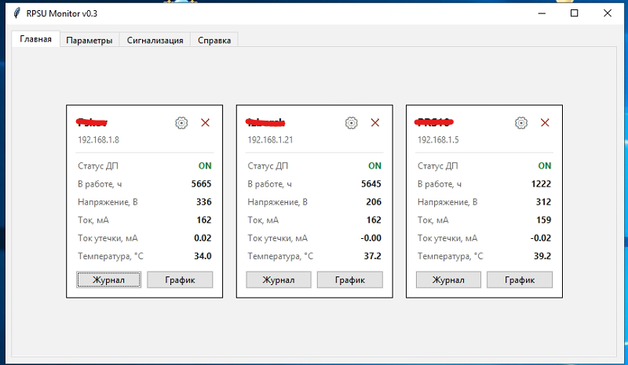
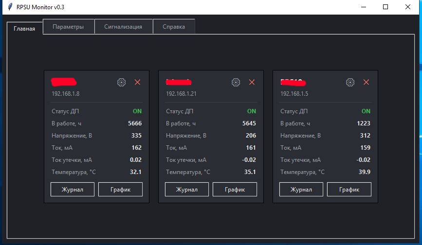
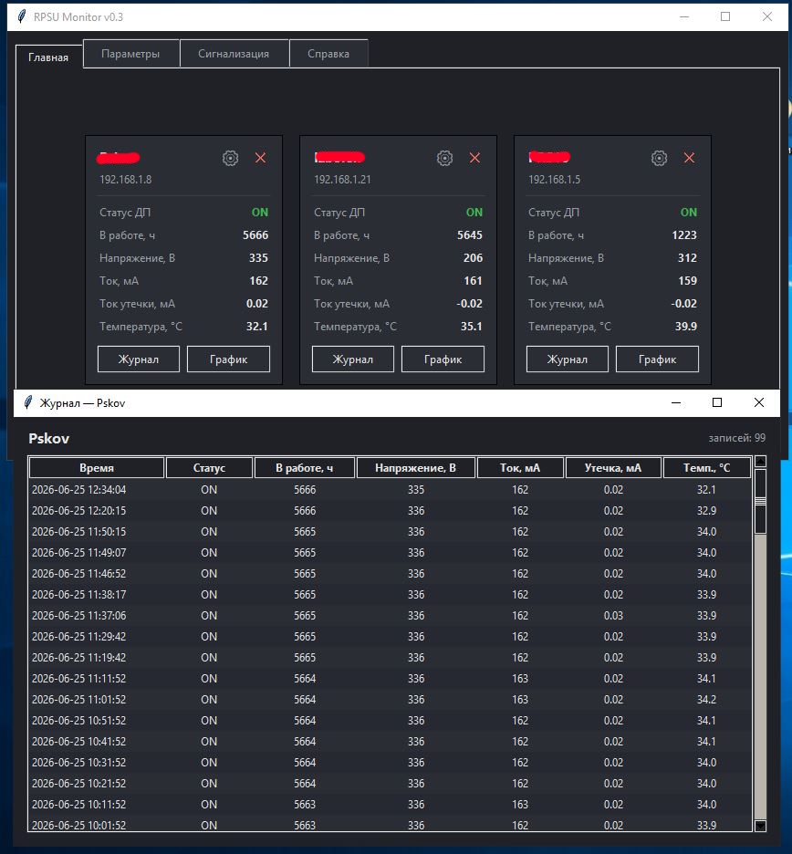
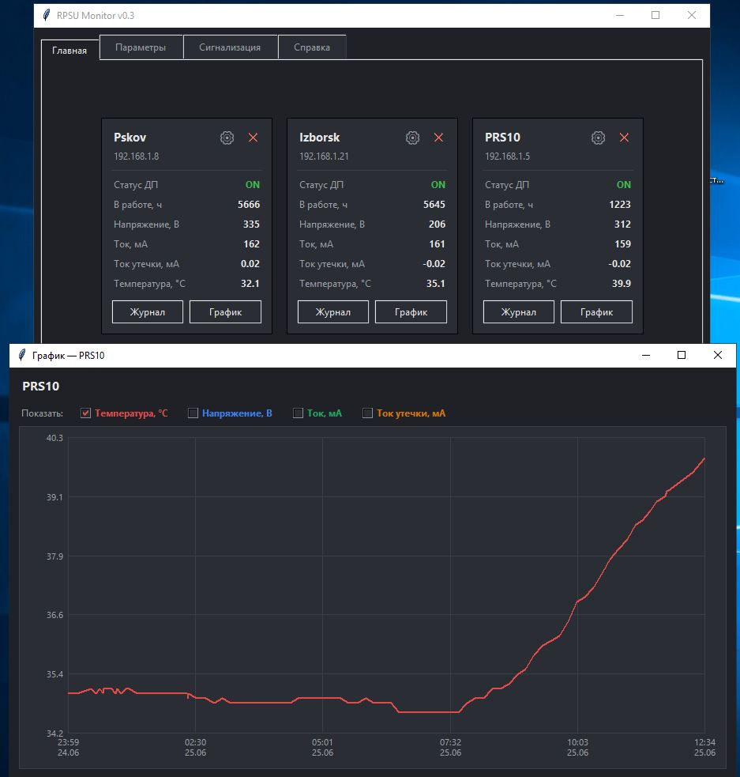
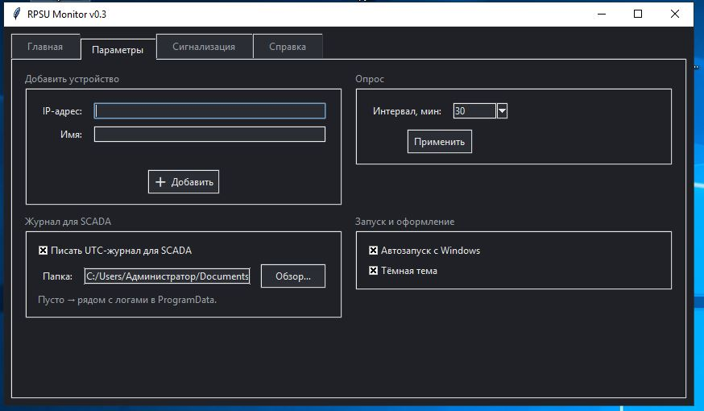
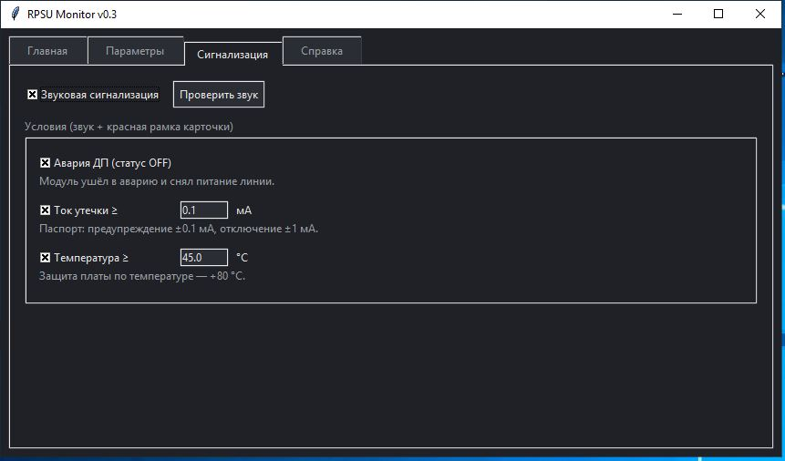

# 📡 RPSU Monitor

**RPSU Monitor** — программа для автоматизированного мониторинга блоков дистанционного
питания (RPSU) оборудования **MGS-4 (Megatrans-4)** по протоколу **Telnet**. Собирает,
обрабатывает, сохраняет и визуализирует параметры регенераторов в кабельной линии связи,
а также подаёт звуковую сигнализацию при авариях.



---

## 📘 Назначение

MGS-4 — магистральная цифровая система передачи для связи по неуплотнённым физическим
кабельным линиям. Ручной опрос блоков питания требует сложных действий и присутствия
персонала. **RPSU Monitor** автоматизирует это и показывает по каждому устройству:

* Статус работы
* Время работы (Uptime)
* Напряжение (Voltage)
* Ток нагрузки (Current)
* Ток утечки (Leak Current)
* Температуру (Temperature)

Пример ручного вывода с платы ДП MGS-4:


> **Важно:** при утечке тока ≥ 1 мА блок отключает питание линии и переходит в аварию
> (повторный запуск — только вручную). Предупреждение — уже при ±0.1 мА.

---

## ⚙️ Возможности

* ✅ Опрос по Telnet через «сырой» TCP-сокет — надёжно работает со старыми MGS-4
* ✅ До **5 устройств**, интервал опроса 1 / 5 / 10 / 15 / 30 / 60 мин
* ✅ Карточки с **цветным статусом**, **светлая и тёмная** темы
* ✅ **Журнал-таблица** и **графики трендов** по выбранным параметрам
* ✅ **Звуковая сигнализация** по условиям (ток утечки, температура, авария ДП)
* ✅ UTC-журнал для **интеграции со SCADA** (папку CSV задаёте сами)
* ✅ **Автозапуск с Windows** и сворачивание в системный трей
* ✅ Данные в `ProgramData`; установщик и портативная версия
* ✅ Интерфейс на русском языке

---

## 🖼️ Скриншоты

| Тёмная тема | Журнал (таблица) |
|---|---|
|  |  |

| График трендов | Вкладка «Параметры» | Вкладка «Сигнализация» |
|---|---|---|
|  |  |  |

---

## 🚀 Установка и автозапуск

Два варианта поставки (см. раздел Releases):

* **Установщик** `RPSU-Monitor-0.3-setup.exe` (Inno Setup) — ставит программу в
  `C:\Program Files\RPSU Monitor\`, создаёт папку данных в `ProgramData`, ярлыки в «Пуск».
* **Портативная версия** — `RPSU.exe` в архиве, запуск без установки.

**Автозапуск** включается в самой программе: вкладка **«Параметры» → «Автозапуск с
Windows»**. Галочка прописывает запуск в реестр текущего пользователя (`HKCU\…\Run`),
без прав администратора. После сбоя питания и перезагрузки сервера программа поднимается
сама, как только в систему входит пользователь (или срабатывает автологин).

> ⚠️ Автозапуск срабатывает **при входе пользователя**. Если сервер после перезагрузки
> стоит на экране входа и никто не логинится — включите **автологин** выделенной учётки.

---

## 🔔 Сигнализация

Вкладка **«Сигнализация»**: мастер-галочка звука, кнопка «Проверить звук» и условия —
при срабатывании любого звучит негромкий сигнал, а карточка устройства обводится красным.
Изменение порогов применяется **мгновенно**, не дожидаясь следующего опроса.

| Условие | По умолчанию | Обоснование (паспорт MGS-4) |
|---|---|---|
| Авария ДП (статус OFF) | вкл | модуль снял питание линии |
| Ток утечки ≥ 0.1 мА | вкл | предупреждение ±0.1 мА, отключение ±1 мА |
| Температура ≥ 45 °C | вкл | защита платы по температуре +80 °C |

---

## 📈 Графики

Кнопка **«График»** на карточке открывает тренды по данным журнала: ось времени,
галочками выбираются параметры (температура, напряжение, ток, ток утечки) — каждый
своей цветной линией. Ось Y масштабируется под выбранные параметры; дата на оси
появляется, когда данные заходят на другой день. Загружается до 10 000 последних точек.

---

## 📁 Расположение файлов

Программа (`RPSU.exe`) — в `Program Files`, а **данные — в `C:\ProgramData\RPSU Monitor\`**
(в Program Files запись заблокировал бы UAC). Папка для SCADA-журнала задаётся в программе.

| Файл | Где | Назначение |
|---|---|---|
| `config.json` | `…\ProgramData\RPSU Monitor` | устройства, интервал, UTC, путь SCADA, тема, пороги |
| `rpsu.log` | `…\ProgramData\RPSU Monitor` | журнал диагностики (старт, ошибки подключения) |
| `{name}_data.csv` | `…\ProgramData\RPSU Monitor` | основной журнал измерений |
| `{name}_utc_data.csv` | папка, заданная в «Параметрах» | журнал в формате UTC для SCADA |

> Старый `devices.json` при первом запуске автоматически переносится в `config.json`.

---

## 🔌 Интеграция со SCADA

1. На вкладке **«Параметры»** укажите **папку для SCADA CSV** (кнопка «Обзор…») — ту,
   что читает CSV-драйвер Rapid SCADA, и включите **«Писать UTC-журнал для SCADA»**.
2. Прикрепите `{device}_utc_data.csv` из этой папки в драйвер CSV-считывателя.
3. Настройте каналы опроса и события, соберите дашборд на мнемосхеме.


---

## 🛠️ Сборка из исходников

Требуется Python 3.10+ и (для установщика) [Inno Setup](https://jrsoftware.org/isdl.php).

```bat
pip install -r requirements.txt pyinstaller
build.bat
```

`build.bat` соберёт `dist\RPSU.exe` (PyInstaller) и, если найден Inno Setup, установщик
`installer\Output\RPSU-Monitor-0.3-setup.exe`.

---

## 🧰 Технологии

* Python 3, `tkinter` (GUI), `socket` (telnet), `threading`, `csv`, `winsound`
* `pystray` + `Pillow` (системный трей)
* Сборка: PyInstaller; установщик: Inno Setup
* Windows (рекомендуется Windows Server); проверено на Windows 10/11

---

## 🧑‍💻 Автор

UterGrooll
